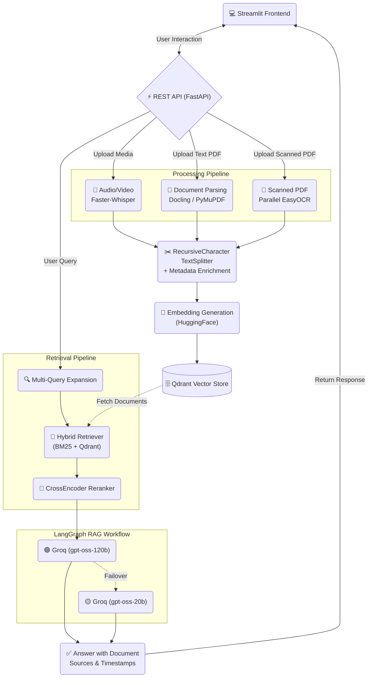

# 🧠 CogniSphere - AI Multimedia Knowledge Assistant

A production-ready Retrieval-Augmented Generation (RAG) assistant capable of understanding multimedia content using **Streamlit + FastAPI + LangGraph + SQLite + Qdrant + Faster-Whisper + EasyOCR**.

## Features

- **Multimedia Processing:** Upload and process videos (mp4, mov, mkv, avi, webm), audio (mp3, wav, m4a, flac), and documents (pdf, docx, pptx, txt).
- **Intelligent PDF Handling:** Uses **Docling** as the primary parser for deep document understanding, with fallback to PyMuPDF and an advanced parallel **EasyOCR** pipeline for scanned/image-based documents.
- **Audio/Video Transcription:** Automatic, high-quality transcription using Faster-Whisper.
- **LLM Integration:** Inference powered by **Groq**, using `gpt-oss-120b` as primary and `gpt-oss-20b` as fallback for lightning-fast RAG responses.
- **Advanced Hybrid Retrieval:** Combines sparse (BM25) and dense (Qdrant) vector search, augmented with **Multi-Query Expansion** and **CrossEncoder Reranking** for high-precision semantic retrieval.
- **Modern UI:** A sleek, fully-featured dark-mode Streamlit frontend featuring a custom `ui_enhancer.py` with 3D flip cards, glassmorphism timeline steps, prompt pills, and real-time processing statistics.
- **Rich Citations:** Natural language Q&A with exact source citations and timestamp references for multimedia.

## Prerequisites

- Python 3.10+
- FFmpeg (required for video/audio processing)

## Setup

1. **Clone the repository:**
```bash
git clone <repository-url>
cd AI_Multimedia_Assistant
```

2. **Install dependencies:**
```bash
pip install -r requirements.txt
```
*(Note: Installing PyTorch and EasyOCR may take some time depending on your internet connection)*

3. **Configure environment:**
```bash
cp .env.example .env
# Edit .env with your API keys (Groq)
```

4. **Create necessary directories:**
```bash
mkdir -p storage/uploads storage/transcripts storage/temp storage/qdrant
```

## Architecture Flow



## Running the Application

### Backend (FastAPI)
The backend handles all heavy lifting: chunking, OCR, embeddings, and LLM querying.
```bash
cd backend
uvicorn app.main:app --reload --host 0.0.0.0 --port 8000
```

### Frontend (Streamlit)
The frontend provides the conversational UI and dashboard.
```bash
cd frontend
streamlit run Home.py
```

## Configuration (.env)

Here is a sample of the key configuration variables:

```env
# Database
DATABASE_URL=sqlite:///./multimedia_assistant.db

# LLM Integration
LLM_PROVIDER=gpt-oss-120b
GROQ_API_KEY=your_groq_key

# Embeddings
EMBEDDING_PROVIDER=huggingface

# OCR Pipeline
OCR_LANGUAGE=en
OCR_DPI=200
OCR_MAX_WORKERS=4

# Whisper settings
WHISPER_MODEL_SIZE=base
WHISPER_DEVICE=cpu
```

## Usage

1. Start both backend and frontend servers.
2. Navigate to the **Upload** page in the sidebar and add multimedia files.
3. Wait for the automatic processing, transcription, and OCR to complete.
4. Go to the **Chat** page to ask questions about your documents and media.
5. View system statistics on the **Home** dashboard or previous conversations on the **History** page.
